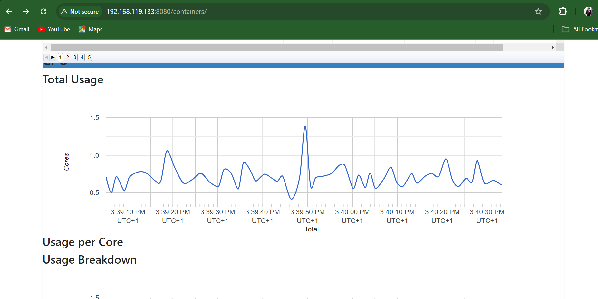

# Application Monitoring Project

This project demonstrates the setup and usage of various monitoring tools using two virtual machines (VMs). The monitoring tools include Prometheus, Alertmanager, Grafana, Node Exporter, Blackbox Exporter, and cAdvisor. The project showcases the skills required to configure these tools, set up a monitoring environment, and visualize metrics.

## Project Overview

The goal of this project is to create a comprehensive monitoring setup for applications and system metrics. By the end of this project, you'll have a deep understanding of:

- Setting up monitoring tools like Prometheus, Alertmanager, Grafana, Node Exporter, Blackbox Exporter, and cAdvisor.
- Configuring Prometheus to scrape metrics from different endpoints.
- Visualizing the metrics using Grafana.
- Setting up alert rules and notifications using Prometheus and Alertmanager.
- Running a Python Flask application in a Docker container and monitoring its metrics and that of the host Virtual Machine.

## Skills Gained

- **System Monitoring:** Learn how to monitor system metrics using Node Exporter and cAdvisor.
- **Application Monitoring:** Monitor a Python Flask application running in a Docker container.
- **Alerting:** Set up alert rules in Prometheus and send alerts using Alertmanager.
- **Visualization:** Use Grafana to create dashboards and visualize the collected metrics.
- **Infrastructure Automation:** Automate the setup of the monitoring environment using Vagrant and shell scripts.

## Tools Used

- **Prometheus:** An open-source monitoring system with a dimensional data model, flexible query language, efficient time series database, and modern alerting approach.
- **Alertmanager:** Handles alerts sent by client applications such as the Prometheus server. It takes care of deduplicating, grouping, and routing them to the correct receiver.
- **Grafana:** An open-source platform for monitoring and observability that lets you visualize and explore metrics.
- **Node Exporter:** Collects hardware and OS metrics exposed by *NIX kernels.
- **Blackbox Exporter:** Allows blackbox probing of endpoints over HTTP, HTTPS, DNS, TCP, ICMP, and gRPC.
- **cAdvisor:** cAdvisor (Container Advisor) provides container users an understanding of the resource usage and performance characteristics of their running containers. It is a running daemon that collects, aggregates, processes, and exports information about running containers. Specifically, for each container it keeps resource isolation parameters, historical resource usage, histograms of complete historical resource usage and network statistics. This data is exported by container and machine-wide.
- **Vagrant:** A tool for building and managing virtual machine environments in a single workflow.
- **Docker:** A platform for developing, shipping, and running applications inside containers.

## Project Setup Guide

### Prerequisites

- Ensure you have Vagrant and VirtualBox installed on your host machine.
- Ensure you have internet access for downloading necessary packages and tools.

### VM Configuration

This project uses two VMs configured using Vagrant. Below are the configuration details:

#### VM-1 (Monitoring Tools)

**Vagrantfile:**

```ruby
Vagrant.configure("2") do |config|
    config.vm.box = "ubuntu/jammy64"

    # Port forwarding to access Prometheus, Alertmanager, Blackbox Exporter, and Grafana on the browser.
    config.vm.network "forwarded_port", guest: 9090, host: 9090
    config.vm.network "forwarded_port", guest: 9115, host: 9115
    config.vm.network "forwarded_port", guest: 9093, host: 9093
    config.vm.network "forwarded_port", guest: 3000, host: 3000

    # Configure a bridged network
    config.vm.network "public_network", bridge: "Intel(R) Dual Band Wireless-AC 8260"

    # Configure VM resources
    config.vm.provider "virtualbox" do |vb|
      vb.memory = "4096"
      vb.cpus = 2
    end
  
    # Provisioning script
    config.vm.provision "shell", inline: <<-SHELL
      sudo apt-get update
      sudo apt-get install -y wget apt-transport-https ca-certificates curl software-properties-common

      # Install Prometheus
      wget https://github.com/prometheus/prometheus/releases/download/v2.53.1/prometheus-2.53.1.linux-amd64.tar.gz
      tar -xvf prometheus-2.53.1.linux-amd64.tar.gz
      sudo mv prometheus-2.53.1.linux-amd64/ prometheus

      # Install Blackbox Exporter
      wget https://github.com/prometheus/blackbox_exporter/releases/download/v0.25.0/blackbox_exporter-0.25.0.linux-amd64.tar.gz
      tar -xvf blackbox_exporter-0.25.0.linux-amd64.tar.gz
      sudo mv blackbox_exporter-0.25.0.linux-amd64/ blackbox_exporter

      # Install Alertmanager
      wget https://github.com/prometheus/alertmanager/releases/download/v0.27.0/alertmanager-0.27.0.linux-amd64.tar.gz
      tar -xvf alertmanager-0.27.0.linux-amd64.tar.gz
      sudo mv alertmanager-0.27.0.linux-amd64/ alertmanager

      # Install Grafana
      wget https://dl.grafana.com/oss/release/grafana-11.1.3.linux-amd64.tar.gz
      tar -zxvf grafana-11.1.3.linux-amd64.tar.gz
    SHELL
  end
```

#### **VM-2 (Application and Metrics)**

**Vagrantfile:**
```ruby
# Vagrantfile for setting up a local environment VM-2 (Application and Metrics)

Vagrant.configure("2") do |config|
    # Use Ubuntu 22.04 as the base box
    config.vm.box = "ubuntu/jammy64"

    # Configure a bridged network and automatically select the desired interface
    config.vm.network "public_network", bridge: "Intel(R) Dual Band Wireless-AC 8260"

    # Port forwarding to access Node-exporter on the browser.
    config.vm.network "forwarded_port", guest: 9100, host: 9100

    # Port forwarding to access PYTHON-Flask Application on the browser.
    config.vm.network "forwarded_port", guest: 5000, host: 5000

    # Port forwarding to access cAdvisor Metrics on the browser.
    config.vm.network "forwarded_port", guest: 8080, host: 8080
      
    # Configure VM resources
    config.vm.provider "virtualbox" do |vb|
      vb.memory = "4096"
      vb.cpus = 2
    end
      
    # Provisioning script
    config.vm.provision "shell", inline: <<-SHELL
      # Update and install necessary packages
      sudo apt-get update -y
      sudo apt-get install -y apt-transport-https ca-certificates curl software-properties-common
  
      # Install Docker
      sudo apt-get install -y docker.io
      sudo systemctl start docker
      sudo systemctl enable docker
      sudo chmod 666 /var/run/docker.sock
  
      # Install node_exporter 
      wget https://github.com/prometheus/node_exporter/releases/download/v1.8.2/node_exporter-1.8.2.linux-amd64.tar.gz
      tar -xvf node_exporter-1.8.2.linux-amd64.tar.gz
      sudo rm node_exporter-1.8.2.linux-amd64.tar.gz
      sudo mv node_exporter-1.8.2.linux-amd64/ node_exporter
      sudo mv node_exporter/node_exporter /usr/local/bin/

      # Clone Application Repository
      git clone https://github.com/Godfrey22152/quiz_game_app.git

    SHELL  
  end
```

## Project Setup Steps

### **Step 1: Clone the Repository**
```bash
git clone https://github.com/Godfrey22152/Application-Monitoring-Project.git
cd Application-Monitoring-Project
```
### **Step 2: Start the VMs and SSH into the VMs**

#### **Start the VMs**
```bash
vagrant up
```
This command will bring up both VMs and automatically configure the environment as specified in the Vagrantfiles.

#### **SSH into the VMs**
```bash
vagrant ssh
```
This command will grant you access into the both VMs.

### **Step 3: Setup the Application and Monitoring Tools**
A detailed guide on steps to setup the monitoring tools and running the application is included project repository with name: `<Infra-Steps-Setup.md>`, kindly see file and follow the steps in the file to get the application and monitoring tools running.

### **Step 4: Access the Application and Monitoring Tools**
- **Prometheus:** Access Prometheus at `http://localhost:9090` or `http://<VM-IP>:9090`.
- **Alertmanager:** Access Alertmanager at `http://localhost:9093` or `http://<VM-IP>:9093`.
- **Grafana:** Access Grafana at `http://localhost:3000` or `http://<VM-IP>:3000`.
- **Node Exporter:** Access Node Exporter at `http://localhost:9100` or `http://<VM-IP>:9100`.
- **Blackbox Exporter:** Access Blackbox Exporter at `http://localhost:9115` or `http://<VM-IP>:9115`.
- **cAdvisor:** Access cAdvisor at `http://localhost:8080` or `http://<VM-IP>:8080`.
- **Flask Application:** Access the Flask application at `http://localhost:5000` or `http://<VM-IP>:5000`.

## Configuration Files
The configuration files for Prometheus and Alertmanager are included in the project repository, See `<Infra-Steps-Setup.md>`file. These files should be placed in their respective directories on VM-1.

---
## Project Screenshoot Images

- **Flask Application Dashboard**


- **Prometheus Targets, Alerts and Dashboard**


- **Node Exporter Dashboard**


- **Alertmanager Dashboard**


- **Blackbox Exporter Dashboard**


- **Google cAdvisor Dashboard**




- **Grafana Dashboards**


- **Website-Up/Down Email Alert from Alertmanager**


---
## Conclusion
This project demonstrates the ability to set up a full monitoring stack using popular tools like Prometheus and Grafana. It also highlights the skills required to manage and visualize system and application metrics. This setup is suitable for both development and production environments, providing valuable insights into system performance and application health.


